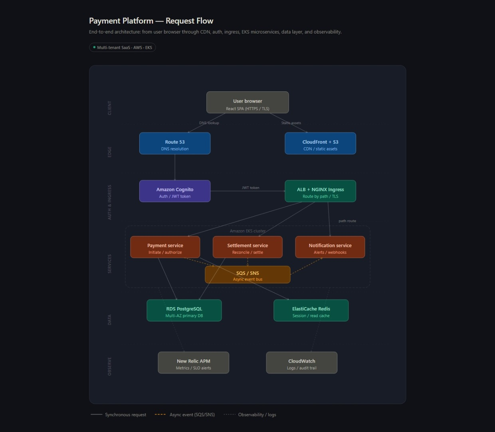

# Introduction

---

## 1. Tell me about yourself

I’m Sravan, a DevOps Engineer with around 5 years of experience, currently working at TCS in the Cloud & Platform Operations team.

My team is a cross-functional group of about 8 engineers — including DevOps engineers, cloud architects, a DBA, and application developers — all working together to ensure platform reliability and delivery velocity.

### My Contributions
- Own Kubernetes infrastructure (Amazon EKS)
- Manage cluster health, auto-scaling, ingress, and high availability
- Lead CI/CD pipelines using Jenkins and GitHub Actions
- Provision infrastructure using Terraform
- Built Python automation scripts to reduce manual toil

### Observability & Reliability
- Manage New Relic dashboards and alerting
- Maintain ~99.9% uptime in production
- Actively involved in incident management and RCA

I’m now targeting an SRE role to focus on SLOs, SLIs, and building resilient, self-healing systems.

---

## 2. Application Architecture (Static View)

Our application follows a microservices-based architecture deployed on AWS.

### Frontend Layer
- React-based web application
- Hosted on S3 and served via CloudFront (CDN)
- DNS handled by Route 53

### API & Compute Layer
- Node.js microservices
- Containerized using Docker
- Deployed on Amazon EKS (Kubernetes)
- Each service has independent deployment and scaling
- NGINX Ingress Controller for routing

### Communication Layer
- REST APIs → synchronous communication
- SNS/SQS → asynchronous event-driven communication

### Data Layer
- Amazon RDS (PostgreSQL, Multi-AZ)
- ElastiCache (Redis) for caching

### Authentication & Security
- Amazon Cognito (JWT, OAuth)
- Role-Based Access Control (RBAC)

### Infrastructure & Deployment
- Terraform (modular setup)
- Separate environments: dev, staging, production

### Observability
- New Relic (APM, metrics, alerting)
- SLIs: latency, error rate, throughput

👉 This architecture ensures scalability, fault isolation, and high availability.

---

## 3. What business does your application fulfill?

Our application is a cloud-based **B2B payment management platform**.

### Core Business Functions

#### Payment Processing
- Initiate, track, and reconcile payments
- Integrates with payment gateways and banks
- Microservices isolate failures

#### User & Access Management
- Role-based access control
- Managed via Amazon Cognito

#### Audit & Compliance
- Full traceability of transactions
- Required for fintech regulations

### SRE Perspective
- High-stakes system (downtime = revenue loss)
- Maintain ~99.9% uptime
- Defined SLOs:
  - Payment success rate
  - Transaction latency
- Runbooks for failure scenarios

---

## 4. What companies are you serving?

We operate a **multi-tenant B2B SaaS platform** serving ~15–20 enterprise clients.

### Industry Segments

#### Retail & E-commerce
- Vendor payments and refunds
- Traffic spikes 3x–5x during peak seasons

#### Logistics & Supply Chain
- Freight reconciliation and settlements
- Strong audit requirements

#### Financial Services
- Internal treasury operations
- Strict compliance and access control

### Scale
- ~50,000 to 80,000 transactions/day
- Higher during peak periods

### SRE Considerations
- Namespace-level isolation in EKS
- Resource quotas per tenant
- Minimize blast radius
- Tenant-specific alerting

---

## 5. Request Flow (Dynamic View)

### Step-by-Step Flow

1. User accesses application  
   → DNS resolved via Route 53  

2. Frontend delivery  
   → CloudFront serves static content from S3  

3. Authentication  
   → User authenticates via Amazon Cognito  
   → JWT token is issued  

4. API Request  
   → Request goes to Application Load Balancer (ALB)  
   → ALB forwards to NGINX Ingress on EKS  

5. Routing  
   → Ingress routes request to correct microservice  

6. Service Processing  
   → Microservices communicate:
   - REST (synchronous)
   - SQS/SNS (asynchronous)

7. Data Access  
   → Writes to RDS PostgreSQL  
   → Reads via Redis cache  

8. Async Processing  
   → Events pushed to SQS  
   → Other services consume independently  

9. Observability  
   → Metrics → New Relic  
   → Logs → CloudWatch  

👉 This flow ensures decoupling, scalability, and resilience.

---

## Request Flow Diagram



---

## Architecture Diagram

```mermaid
flowchart TD

User --> Route53[Route 53]
Route53 --> CloudFront[CloudFront CDN]
CloudFront --> S3[S3 React Frontend]

CloudFront --> ALB[Application Load Balancer]

ALB --> Ingress[NGINX Ingress EKS]

Ingress --> ServiceA[Service A NodeJS]
Ingress --> ServiceB[Service B NodeJS]
Ingress --> ServiceC[Service C NodeJS]

ServiceA --> RDS[RDS PostgreSQL Multi AZ]
ServiceB --> RDS
ServiceC --> RDS

ServiceA --> Redis[ElastiCache Redis]

ServiceA --> SQS[SNS SQS]
SQS --> ServiceB
SQS --> ServiceC

User --> Cognito[Amazon Cognito]
Cognito --> ALB

ServiceA --> NewRelic[New Relic]
ServiceB --> NewRelic
ServiceC --> NewRelic